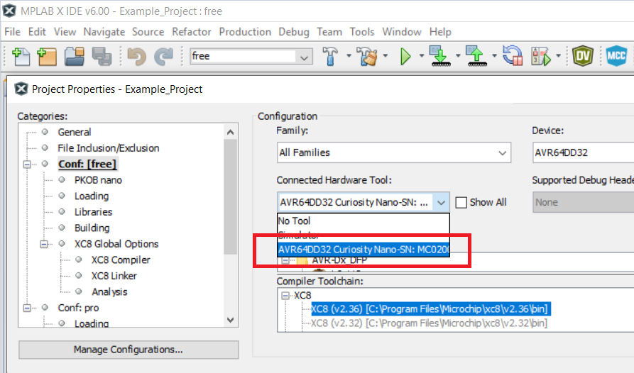

[](https://www.microchip.com)

# Getting Started with Button Matrix Using the AVR64DD32 Microcontroller with MCC Melody

This application demonstrates how to read a `4x4` button matrix using a low number of pins.

A debounce mechanism is implemented for each button. The Debounced Button state is used to detect short and long button presses. Moreover, it detects the short press and long press of two buttons at the same time.

When three ore more buttons pressed at the same time cannot be reliably decoded due to physical limitations, the user will be notified of an ambiguous detection.

Only eight GPIO pins are needed to read the states of all sixteen buttons. Four pins are used for the matrix rows, and four pins for the matrix columns. The TCA0 timer is used to scan the button values at regular intervals, and the RTC is used to measure the long press time.

The setup schematic is presented below.

<br>

All the microcontroller pins connected to the button matrix are initially configured as inputs. The _reading_ pins are connected to the matrix rows, and have the internal pull-up enabled. The _driving_ pins are connected to the button matrix columns.

To check a button's state, the _driving_ pins will be configured as outputs and driven low, one at a time, as shown in the animation below.

<br>

After configuring one _driving_ pin (a pin connected to a button matrix column) as output, the states of all the _reading_ pins (the pins connected to the button matrix rows) will be read inside a `for` loop.

The _driving_ pin output is low.

- If the _reading_ pin state is '1', this means the state is driven high by the internal pull-up of the _reading_ pin, therefore the button at that position (`row x column`) is not pressed. There is no electrical connection between the _driving_ pin and the _reading_ pin.
- If the read state is '0', this means the _reading_ pin is connected to the _driving_ pin (the _driving_ pin is low). The button at that position **is** pressed.

The animation below shows the setup behavior when a button is pressed, and the corresponding column is configured as output.

<br>

The sequential and timing diagram for the application main modules is presented below.

<br>

There are five main functional blocks in this demo application:

1. **The Main Function**: Initializes the entire system, the peripherals, and the button matrix driver and event handler. Inside the infinite loop, when an event occurs, a message will be transmitted over USART.

2. **The Button Matrix Event Handler**: Is a software layer that is notified by the button matrix library if there was a short button press, a long button press or if multiple buttons were pressed. The event handler receives one button index and state and calls the user callback function passing the event and the buttons as arguments.

3. **The Button Matrix Driver**: Implements the low-level functions used to initialize the button matrix variables and pins. It also reads the buttons' states.

4. **The TCA0 Interrupt Routine**: Periodically triggers a Button Matrix Driver callback function that scans the entire button matrix and implements the debounce mechanism.

5. **The RTC Interrupt Routine**: When this interrupt is triggered, it means the long-press time-out expired, therefore a long press is detected, and the Button Matrix Event Handler is notified.

The application flow diagram is presented below.

<br>

<br>

When developing embedded applications, the interrupt routines must be as fast as possible, to avoid timing issues, and to make sure all interrupts are handled. Therefore, the USART transmission (which is time-consuming) must not be done in the Interrupt Service Routine (ISR), but in the mainline code.

The user callback function is called from within the ISR. It assigns the event and buttons values to the `event`, `btn1`, and `btn2` global variables that will be then used in the mainline code to send USART messages.

An `ATOMIC_BLOCK` is used inside the infinite loop to copy the event and the button values from the global variables to the corresponding local variables (`temp_event`, `temp_btn1`, and `temp_btn2`). Because interrupts are suppressed while inside the atomic block, this prevents data from being corrupted in case another interrupt is triggered before it is copied. If the global variables were used directly, there might have been a risk of them being corrupted. For example, another interrupt modifying the global variables while being transmitted will generate a mismatch between the event and the button.

```
ATOMIC_BLOCK(ATOMIC_RESTORESTATE)
{
    if(event != NONE)
    {
      temp_event = event;
      temp_btn1 = btn1;
      temp_btn2 = btn2;

      event = NONE;
      btn1 = BM_NULL_BTN;
      btn2 = BM_NULL_BTN;
    }
}
```

## Related Documentation

More details and code examples on the AVR64DD32 can be found at the following links:

- [AVR64DD32 Product Page](https://www.microchip.com/wwwproducts/en/AVR64DD32)
- [AVR64DD32 Code Examples on GitHub](https://github.com/microchip-pic-avr-examples?q=AVR64DD32)
- [AVR64DD32 Project Examples in START](https://start.atmel.com/#examples/AVR64DD32CuriosityNano)

## Software Used

- [MPLAB® X IDE 6.00 or newer](http://www.microchip.com/mplab/mplab-x-ide)
- [MPLAB® XC8 2.36 or a newer compiler](http://www.microchip.com/mplab/compilers)
- [AVR-Dx Series Device Pack v2.1.152 or newer](https://packs.download.microchip.com)
-  Saleae Logic 2.3.47 or newer
- [MPLAB® Code Configurator](https://www.microchip.com/mplab/mplab-code-configurator) (MCC) 5.1.4 or newer 
- [MPLAB® Code Configurator](https://www.microchip.com/mplab/mplab-code-configurator) (MCC) Device Libraries 8-bit AVR MCUs 2.8.0 or newer 

## Hardware Used

- The AVR64DD32 Curiosity Nano Development Board is used as test platform.
  <br>
- `4x4` Button Matrix
<br>

## Operation

To program the Curiosity Nano board with this MPLAB® X project, follow the steps provided in the [How to Program the Curiosity Nano Board](#how-to-program-the-curiosity-nano-board) chapter.<br><br>

## 1. Library Implementation Details

### 1.1 Overview

This library can be used to detect the following button matrix events:

- Short/long press on one button
- Short/long press on two buttons at the same time
- Three or more buttons pressed at the same time (this is an error because the three buttons cannot be accurately decoded)

The debounce mechanism is implemented on all buttons inside the TCA0 interrupt routine.

The RTC interrupt is used to detect the long press.

### 1.2 Functions

##### `BUTTON_MATRIX_init`

- Prototype:
  <br> `void BUTTON_MATRIX_init(void);`

- Description:
  <br> Initializes the button matrix.
- Parameters:
  <br> N/A

- Return Value:
  <br> N/A

- Example:
  <br> `BUTTON_MATRIX_init();`

##### `BUTTON_MATRIX_setEventCallback`

- Prototype:
  <br> `void BUTTON_MATRIX_setEventCallback(bmEvent_cb_t function);`

- Description:
  <br> Sets the event callback.
- Parameters:
  <br> Callback function

- Return Value:
  <br> N/A

- Example:
  <br> `BUTTON_MATRIX_setEventCallback(event_Cb);`

### 1.3 User callback function

##### `MyEventHandler`

- Prototype:
  <br> `void MyEventHandler(uint8_t button, bool state);`

- Description:
  <br> Receives the state of a button and transmits the MULTIPLE_PRESS and ERROR events.
- Parameters:

  - Button - integer value from 1 to 16
  - State - either PRESSED or RELEASED

- Return Value:
  <br> N/A

- [Back to top](#getting-started-with-button-matrix-using-the-avr64dd32-microcontroller-with-mcc-melody)

## 2. Library Usage Examples

The application is designed so that the pins connected to the rows and columns and the debounce time can be configured. Also, the long press threshold can be configured by updating the RTC settings and re-generating the code using MCC.

### 2.1  Configuring the Pins

The rows and columns pins can be configured using the following macro definitions inside `button_matrix_config.h`:

```
#define CFG_COLUMN0_PORT         PORTC
#define CFG_COLUMN0_PIN          0
#define CFG_COLUMN1_PORT         PORTC
#define CFG_COLUMN1_PIN          1
#define CFG_COLUMN2_PORT         PORTA
#define CFG_COLUMN2_PIN          2
#define CFG_COLUMN3_PORT         PORTA
#define CFG_COLUMN3_PIN          3
#define CFG_ROW0_PORT            PORTA
#define CFG_ROW0_PIN             4
#define CFG_ROW1_PORT            PORTA
#define CFG_ROW1_PIN             5
#define CFG_ROW2_PORT            PORTA
#define CFG_ROW2_PIN             6
#define CFG_ROW3_PORT            PORTA
#define CFG_ROW3_PIN             7
```

Suppose that PA6 pin must be column 2 pin. The following update will be done:

```
...
#define CFG_COLUMN2_PORT         PORTA
#define CFG_COLUMN2_PIN          6
...
```

### 2.2  Configuring the Debounce Time

The debouncing mechanism is implemented by the software.

The TCA0 interrupt is triggered each 5 ms inside the interrupt routine, one column is configured as output (driving low), and all the rows that are connected to that column are scanned.

When the TCA0 interrupt occurs again, the next column is set as an output, the corresponding rows states are scanned, and so on. Therefore, the entire matrix will be scanned once every 20 ms (debounce matrix scanning time).

A button's state is considered stable (debounced) if it has not changed for a predefined debounce time duration. The debounce time is equal to: `debounce factor * button matrix scanning time`.

By default, the debounce factor is 4, resulting in a debounce time of `4 x 20 ms = 80 ms`.

The debounce time can be configured by updating the following macro definition:

```
#define CFG_DEBOUNCE_TIME        4    /* Debounce time of 4 * 20 ms */
```

For example, if a debounce time of 100 ms is desired, the macro definition will be:

```
#define CFG_DEBOUNCE_TIME        5    /* Debounce time of 5 * 20 ms */
```

### 2.3 Configuring the Long-press Time

To configure the long-press time, open the MCC and go to _Project Resources -> Drivers -> RTC. On Easy Setup -> Hardware_, configure the Period as desired. The MCC configuration for this application is presented below:

<br>


After updating the timer period, save the MCC configuration and click **Generate**.

### 2.4 Setting the Callback Function

The following code snippet shows how to set a callback to receive the button matrix events.

```
void MyKeyboardCallback(BUTTON_MATRIX_event_t bm_event, uint8_t bm_btn1, uint8_t bm_btn2)
{
    /* Function that will receive the button events. */
}

int main(void)
{
  SYSTEM_Initialize();

  BUTTON_MATRIX_setEventCallback(MyKeyboardCallback);
  BUTTON_MATRIX_init();

  while(1)
  {
      ;
  }
}
```
- [Back to top](#getting-started-with-button-matrix-using-the-avr64dd32-microcontroller-with-mcc-melody)

## 3. Setup

The AVR64DD32 Curiosity Nano Development Board is used as test platform.


The button matrix in the image below is used to demonstrate the application functionalities.

<br>

The following configurations were be made for this project:

- System Clock frequency: 4 MHz (default)
- USART0:
  - RX, TX enabled
  - Baud rate: 115200, character size: 8 bits, 1 stop bit, no parity
  - Routed to PORTD that is connected to CDC

The USART0 MCC configuration is presented in the figure below.

<br>

<br>

- TCA0:
  - Peripheral clock is System Clock / 64
  - Period: 5 ms
  - Overflow Interrupt enabled
  - Normal Waveform Generation mode
  - TCA0 Timer enabled

The TCA0 MCC configuration is presented in the figure below.

<br>

- RTC:
  - Clock source is 32.768 KHz from OSK32K
  - Prescailing Factor: RTC Clock / 1
  - Period: 2s

The RTC MCC configuration is presented in the figure below.

<br>


- Interrupt Manager
  - Global Interrupt Enable: Checked

The Interrupt Manager MCC configuration is presented in the figure below.

<br>

The initial pin configurations are presented in the table below.

|   Pin    | Configuration  |
| :------: | :------------: |
|   PA2    | Digital Input  |
|   PA3    | Digital Input  |
|   PA4    | Digital Input  |
|   PA5    | Digital Input  |
|   PA6    | Digital Input  |
|   PA7    | Digital Input  |
|   PC0    | Digital Input  |
|   PC1    | Digital Input  |
| PD4 (TX) | Digital Output |
| PD5 (RX) | Digital Input  |

The button matrix pins are connected to the microcontroller pins as presented in the table below.

| Button Matrix Pin | PORT Pin |
| :---------------: | :------: |
|   C3 (Column 3)   |   PA3    |
|        C2         |   PA2    |
|        C1         |   PC1    |
|        C0         |   PC0    |
|    L0 (Line 0)    |   PA4    |
|        L1         |   PA5    |
|        L2         |   PA6    |
|        L3         |   PA7    |

- [Back to top](#getting-started-with-button-matrix-using-the-avr64dd32-microcontroller-with-mcc-melody)

## 4. Demo

### 4.1 Sending a Message Corresponding to Each Event

In this application, a message is sent through USART0 to notify the user when an event is detected.

```
switch(temp_event)
{
  case ERROR:
    printf("Too many buttons are pressed at once!\n\r");
    break;
  case LONG_PRESS:
    printf("S%d was pressed for a long time!\n\r", temp_btn1);
    break;
  case MULTIPLE_SHORT_PRESS:
    printf("S%d and S%d were pressed for a short time!\n\r", temp_btn1, temp_btn2);
    break;
  case MULTIPLE_LONG_PRESS:
    printf("S%d and S%d were pressed for a long time!\n\r", temp_btn1, temp_btn2);
    break;
  case SHORT_PRESS:
    printf("S%d was pressed for a short time!\n\r", temp_btn1);
    break;
  default:
    break;
}

temp_event = NONE;
temp_btn1 = BM_NULL_BTN;
temp_btn2 = BM_NULL_BTN;

```

In this case, the callback function is implemented as presented below.

```
void MyKeyboardCallback(BUTTON_MATRIX_event_t bm_event, uint8_t bm_btn1, uint8_t bm_btn2)
{
    event = bm_event;
    btn1 = bm_btn1;
    btn2 = bm_btn2;
}
```

The image below shows the application functionality.

The following messages are transmitted through USART0:

- S\<N> was pressed for a short time!
- S\<N> was pressed for a long time!
- S\<N> and S\<M> were pressed for a short time!
- S\<N> and S\<M> were pressed for a long time!
- Too many buttons are pressed at once!

**Note**: N and M are the button indexes, as labeled on the PCB board.

**Note**: If more than three buttons are pressed at the same time, the correct buttons cannot be physically detected. Therefore, this is reported as an error.

<br>
- [Back to top](#getting-started-with-button-matrix-using-the-avr64dd32-microcontroller-with-mcc-melody)

## 4.2 Summary

This code example illustrates how to configure TCA0, RTC, EVSYS, USART0, and GPIO to read button states of a button matrix, detect button-press events, and send a message for each event.

<br>

## How to Program the Curiosity Nano Board

This chapter shows how to use the MPLAB® X IDE to program an AVR® device with an Example_Project.X. This can be applied for any other projects.

- Connect the board to the PC.

- Open the Example_Project.X project in MPLAB X IDE.

- Set the Example_Project.X project as main project.

  - Right click on the project in the **Projects** tab and click **Set as Main Project**.
    <br>

- Clean and build the Example_Project.X project.

  - Right click on the **Example_Project.X** project and select **Clean and Build**.
    <br>

- Select the **AVRxxxxx Curiosity Nano** in the Connected Hardware Tool section of the project settings:

  - Right click on the project and click **Properties**
  - Click on the arrow under the Connected Hardware Tool
  - Select the **AVRxxxxx Curiosity Nano** (click on the **SN**), click **Apply** and then click **OK**:
    <br>

- Program the project to the board.
  - Right click on the project and click **Make and Program Device**.
    <br>

<br>

- [Back to 1. Library Implementation Details](#1-library-implementation-details)
- [Back to 2. Library Usage Examples](#2-library-usage-examples)
- [Back to 3. Setup ](#3-setup)
- [Back to 4. Demo](#4-demo)
- [Back to top](#getting-started-with-button-matrix-using-the-avr64dd32-microcontroller-with-mcc-melody)